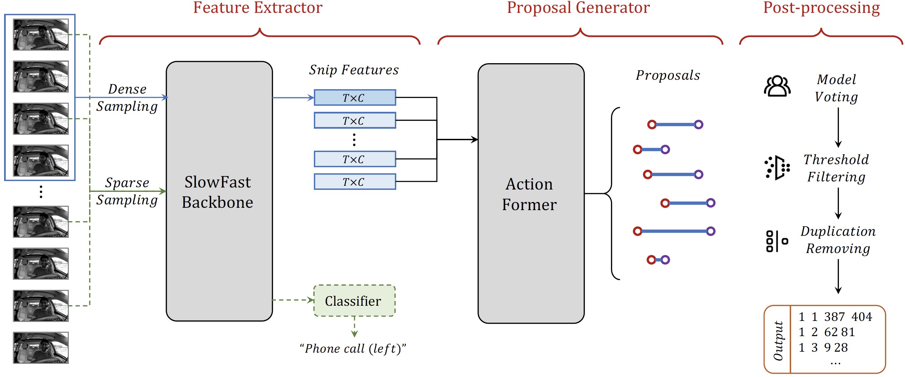

# Code Release for AICITY_2022 Track3 HSNB Team
we make good use of the multi-view synchronization among videos, and conduct robust Multi-View Practice (MVP) for driving action localization. To avoid overfitting, we finetune SlowFast with Kinetics-700 pre-training as the feature extractor. Then the features of different views are passed to ActionFormer to generate candidate action proposals. For precisely localizing all the actions, we design elaborate post-processing, including model voting, threshold filtering and duplication removal.

More details can be found in our workshop paper: **MVP: Robust Multi-View Practice for Driving Action Localization**. To be updated.

## Pre-processing

There are three steps and the details are explained in `README.md` under the corresponding folder:

* pre-processing/gen_frame: In this folder, we decord the original video data as  frames.
* pre-processing/gen_json_and_fea: In this folder, we prepare the action segment temporal location labels as the json format, and collect meta info for all videos, like duration, duration_frame and etc.
* pre-processing/generate_cls_csv: In this folder, we prepare  the action segment classfication labels as the csv format.

## Method

There are five steps:

1. `classification/README.md(Train model)`: Train the basic classification model for  action segments.
2. `classification/README.md(Inference model to extract features)`: Use the well-trained classification model to extract snippet features.
3. `proposal_extract/README.md(Train and inference model)`: Use the snippet features to the train temporal location model, and infercence test dataset to generate proposals.
4. `proposal_extract/README.md(Convert format)`: Convert proposals from pkl format to csv format.
5. `classification/README.md(Inference model to predict proposals)`: Classify the generated proposals.

## Post-processing 

Conduct post-processing following `post-processing/README.md`.

## Acknowledgment 

Our code is built based on [ActionFormer](https://github.com/happyharrycn/actionformer_release) and [SlowFast](https://github.com/facebookresearch/SlowFast).
